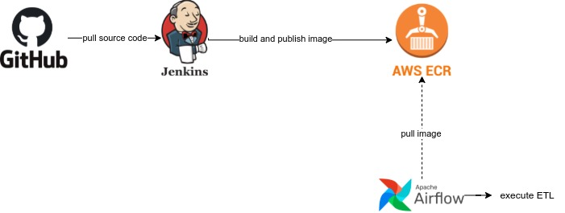

# Deployment Plan

### Plan

The application will be packaged within a docker image and will be published to a **private** container repository (AWS ECR etc..).

During the execution, docker image will be pulled and executed application by setting the necessary configuration.

### Design

- Jenkins pipeline will fetch the source code and build docker image
- Jenkins will publish the built image into AWS ECR
- Workflow mangement tool will pull and execute the application. Apache Airflow in this case.

Following is a high level design diagram with the main technologies included.

